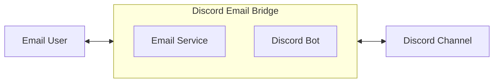
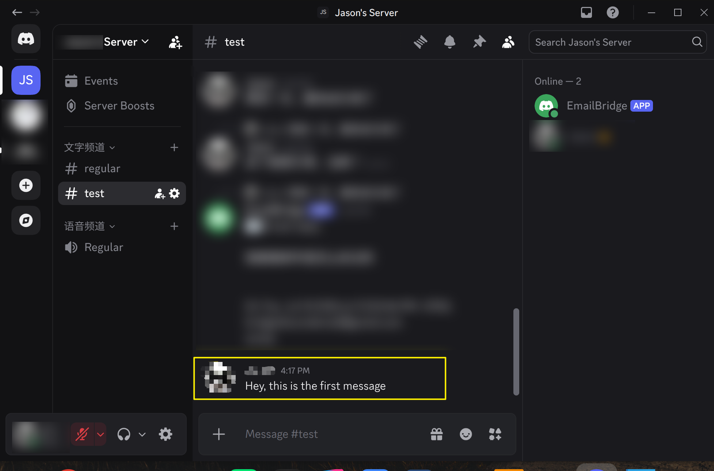
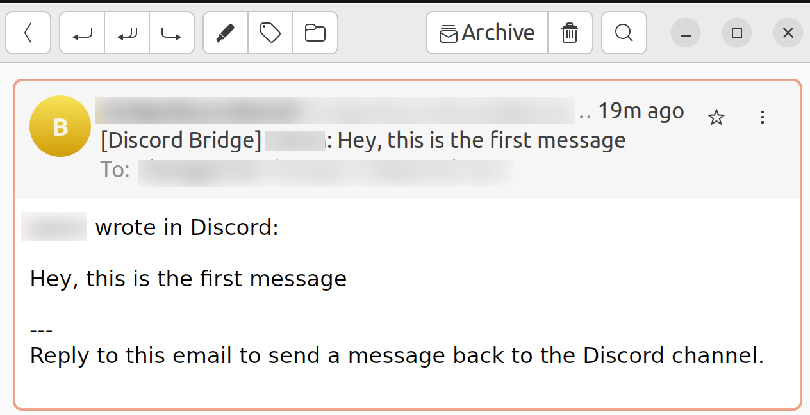

# Discord Email Bridge

A minimal, single-user Discord ↔ Email bidirectional bridge. It lets a project
member who can't use Discord — for example, someone who relies on a screen
reader and prefers email over learning Discord's UI — participate in the
discussion of one fixed Discord channel via email.

This is an **MVP**, built for one Discord channel, one bridge mailbox, and one
email user — not a general-purpose, multi-tenant product.

## Scope

This project exists for a specific case: some visually-impaired users are
already comfortable communicating by email, and would rather not have to
learn Discord's interface and keyboard shortcuts just to join one channel's
discussion. The bridge lets them keep using email while everyone else stays
on Discord.

It's intentionally narrow in scope:

```text
One Discord channel
One bridge email account
One target email user
One allowed reply email address
Plain-text messages only
```

Not supported (yet): multiple channels/servers/users, Discord Threads, exact
email-thread mapping, attachment forwarding, full HTML rendering, a web admin
panel, OAuth, rich-text messages. See the
[CHANGELOG](discord-email-bridge/CHANGELOG.md) for what's actually planned
next.

## How It Works



`Discord Email Bridge` is a single program that is simultaneously a Discord
bot and an SMTP/IMAP email client. It forwards messages from the mailbox into
the Discord channel, and from the Discord channel back into the mailbox.

## Features

- **Discord → Email**: channel messages are forwarded as plain-text email,
  with the sender's name and content.
- **Discord reply → Email**: native Discord replies show up in the email as a
  quote of the original message plus the new reply.
- **Email → Discord**: replying to the bridge mailbox posts the message into
  the Discord channel.
- **Email reply → Discord reply**: replying to a bridged email posts a real
  Discord reply to the original message, not just a plain message.
- **Edit / delete notifications**: editing or deleting a bridged Discord
  message sends an `[Updated]` / `[Deleted]` follow-up email.
- **Security by default**: only one allowed reply sender, no admin bot
  permissions, `@everyone`/`@here` mentions are sanitized, and duplicate
  messages/emails are never re-processed.

## See It in Action

| Discord message | Resulting email |
| :--------------: | :--------------: |
|  |  |

More screenshots (replies, email → Discord, edit/delete) are in the
[User Manual](openDocs/user%20manual.md).

## Quick Start

```bash
# install uv if you don't have it
curl -LsSf https://astral.sh/uv/install.sh | sh

cd discord-email-bridge
cp .env.example .env   # fill in Discord bot token/channel + SMTP/IMAP credentials
uv sync
uv run main.py
```

For the full walkthrough — creating the Discord bot, inviting it with minimal
permissions, setting up a Gmail app password, every `.env` field explained,
and running it long-term with systemd — see the
[Developer Manual](openDocs/developer%20manual.md).

## Documentation

|                     | English                                              | 中文                                              |
| ------------------- | ----------------------------------------------------- | -------------------------------------------------- |
| For end users        | [User Manual](openDocs/user%20manual.md)              | [用户手册](openDocs/zh/用户手册.md)                 |
| For developers        | [Developer Manual](openDocs/developer%20manual.md)    | [开发者手册](openDocs/zh/开发者手册.md)             |
| Version history / roadmap | [CHANGELOG](discord-email-bridge/CHANGELOG.md) | — |

The Developer Manual also covers the module architecture, the full
requirements-tracking table, and the message-mapping/edit-delete-sync design
in detail.

## Security Notes

- Do not commit `.env` to Git (already excluded via `.gitignore`).
- Do not grant the Discord bot `Administrator` — it only needs `View
  Channel` / `Read Message History` / `Send Messages` on one channel.
- Use a dedicated bridge mailbox, not your personal inbox, and an app
  password rather than your real login password.
- No secrets are hardcoded; everything sensitive is read from `.env`.
