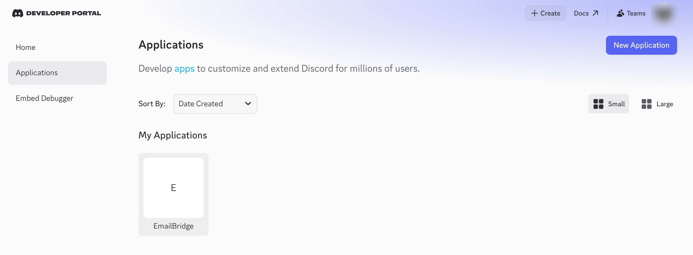
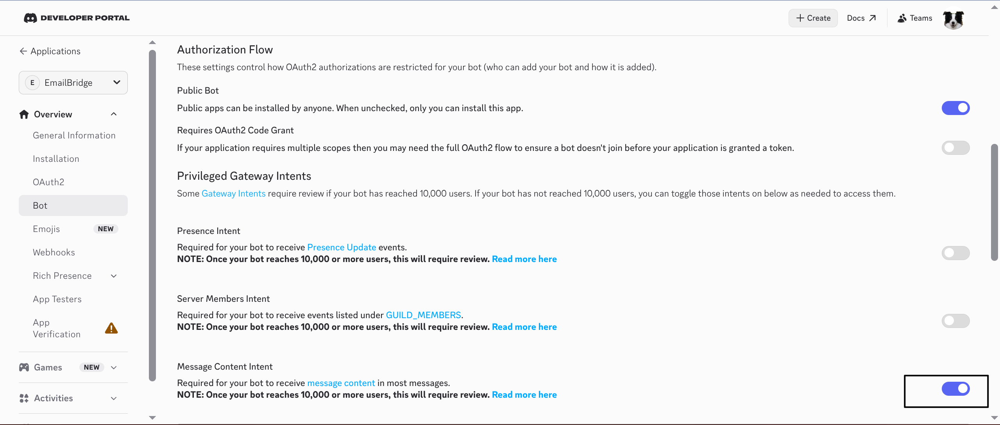
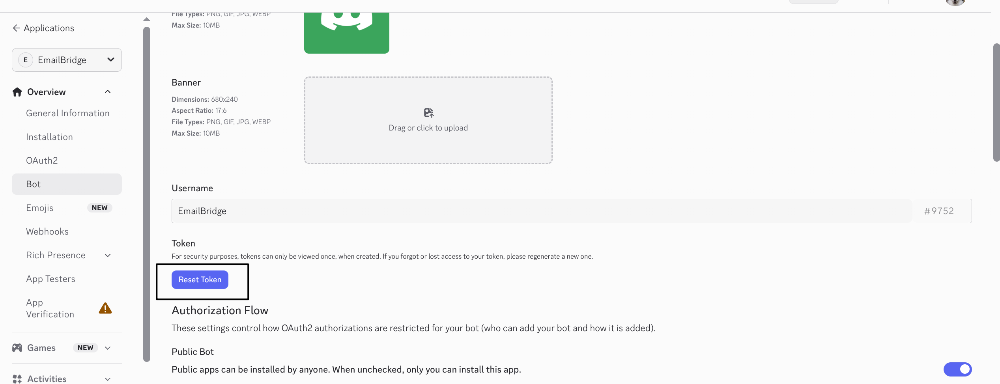
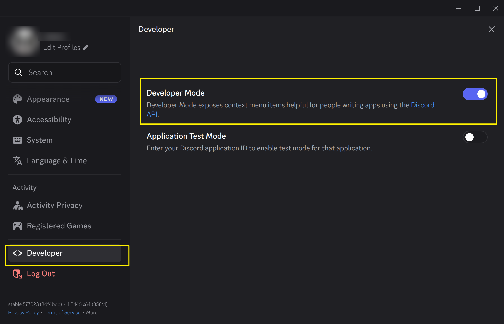
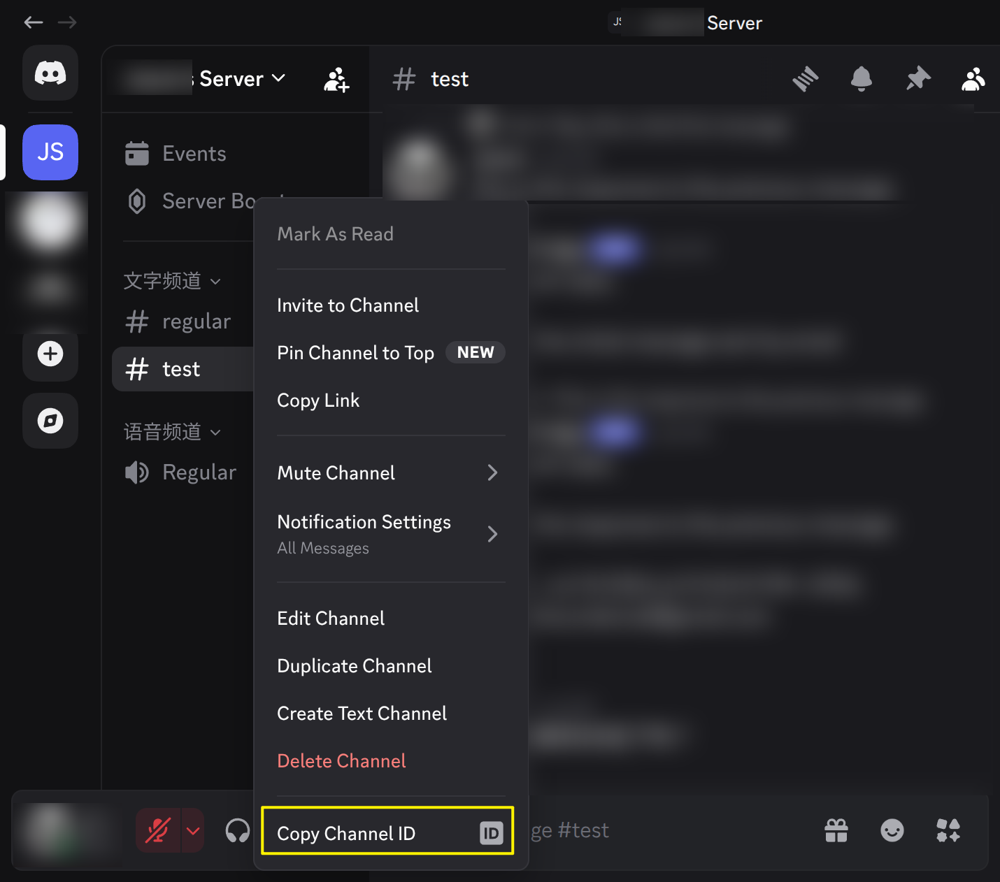
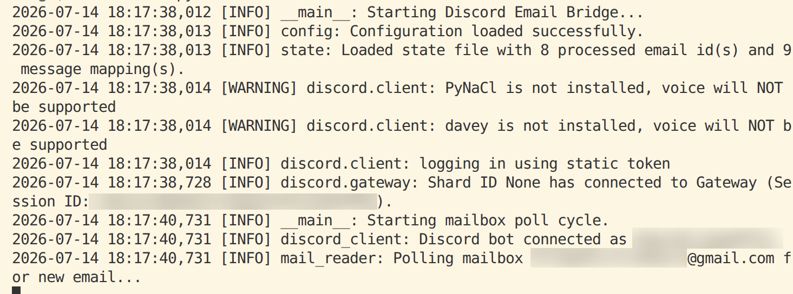
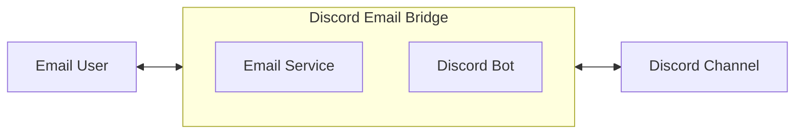

This document assumes you're already familiar with the purpose of the Discord Email Bridge project (see the User Manual). This document covers the technical details developers need to know.

# 1. Deployment

## 1.1 Setting Up an Email Account

It's recommended to use a dedicated bridge email account rather than your personal primary mailbox — first, it limits the blast radius if credentials leak; second, it's easier to manage or disable independently later. Using Gmail as an example:

1. Register a new Gmail account dedicated to the bridge mailbox (you can use an existing account, but this isn't recommended).
2. Enable 2-Step Verification on this account — this is a prerequisite for generating an "App Password": Google Account → Security → 2-Step Verification.
3. Once 2-Step Verification is on, open the [App Passwords page](https://myaccount.google.com/apppasswords) and generate an app password.
4. Write down this 16-character password (**not** your account login password) — you'll fill it into both `SMTP_PASSWORD` and `IMAP_PASSWORD` when configuring `.env` later.
5. Confirm IMAP is enabled on this Gmail account: Gmail Settings → Forwarding and POP/IMAP → Enable IMAP.

If you're using a different email provider, the idea is the same: turn on two-factor authentication / an app-password mechanism, and get a password meant specifically for third-party programs — don't put your account login password directly into `.env`.

## 1.2 Creating a Discord Bot

The screenshots in the User Manual start from "you already have an invite link." Here we cover the preceding steps: creating the Bot, getting the Token, and getting the Channel ID.

1. Open the [Discord Developer Portal](https://discord.com/developers/applications), click **New Application**, and give it a name (e.g. `Email Bridge`).

   > 

2. Go to the **Bot** page on the left, click **Add Bot**.
3. On the Bot page:
   - Turn on **Message Content Intent** (the program needs to read message content).

   > 

4. Click **Reset Token** to get the Bot Token, copy and save it — you'll fill it into `DISCORD_BOT_TOKEN` in `.env` later. **This Token must never be committed to Git or shared with anyone.**

   > 

5. Invite the Bot to the target Server and Channel with minimal permissions — for the detailed step-by-step with screenshots, see Section 1 of the User Manual (generating the invite link, choosing the Server, checking `Send Messages` + `Read Message History`, and separately enabling `View Channel` on just the target channel). Not repeated here.
6. Get the Channel ID: Discord client → Settings → Advanced → turn on "Developer Mode"; then right-click the target channel → Copy Channel ID.

   > 
   >
   > 

7. (Optional) If you want the Bot to only be active in one specific Server, also note down that Server's ID (right-click the Server icon → Copy Server ID) — you'll fill it into `DISCORD_GUILD_ID` later.

## 1.3 Configuring Startup Parameters

Copy the config template:

```bash
cp .env.example .env
```

Fill in `.env` field by field (field definitions are in `config.py`):

|            Variable            | Required |                       Description                       |
| :-----------------------------: | :------: | :-------------------------------------------------------- |
|      `DISCORD_BOT_TOKEN`        |   Yes    | Bot Token obtained in step 4 of 1.2                        |
|      `DISCORD_CHANNEL_ID`       |   Yes    | Channel ID obtained in step 6 of 1.2                       |
|       `DISCORD_GUILD_ID`        |   No     | Restricts the Bot to this one Server only; unset = no restriction |
|   `SMTP_HOST` / `SMTP_PORT`     |   Yes    | Gmail: `smtp.gmail.com` / `587`                             |
| `SMTP_USER` / `SMTP_PASSWORD`   |   Yes    | Bridge mailbox address / app password generated in 1.1      |
|          `SMTP_FROM`            |   Yes    | Sender address, usually the same as `SMTP_USER`             |
|   `IMAP_HOST` / `IMAP_PORT`     |   Yes    | Gmail: `imap.gmail.com` / `993`                             |
| `IMAP_USER` / `IMAP_PASSWORD`   |   Yes    | Same as SMTP, using the same app password                   |
|         `TARGET_EMAIL`          |   Yes    | Target mailbox that receives Discord messages               |
|    `ALLOWED_EMAIL_SENDER`       |   Yes    | The only email address allowed to reply and be forwarded back to Discord |
| `EMAIL_POLL_INTERVAL_SECONDS`   |   Yes    | Mailbox polling interval in seconds, `60` recommended        |
|         `STATE_FILE`            |   No     | Path to the state file, defaults to `state.json`             |
|   `EMAIL_MESSAGE_ID_DOMAIN`     |   No     | Domain used to build email Message-IDs, defaults to `bridge.local`; doesn't need to be a real domain |
|   `INCLUDE_DELETED_CONTENT`     |   No     | Whether delete-notification emails include the original content, defaults to `true` |

In the simplest case, `TARGET_EMAIL` and `ALLOWED_EMAIL_SENDER` are the same person's mailbox.

**`.env` must not be committed to Git** (already excluded via `.gitignore`).

## 1.4 Running the Program

This project uses [uv](https://docs.astral.sh/uv/) to manage dependencies and the virtual environment.

1. Install uv (if you haven't already):

   ```bash
   curl -LsSf https://astral.sh/uv/install.sh | sh
   ```

2. Sync dependencies (this automatically creates `.venv` and installs the versions locked in `uv.lock`):

   ```bash
   uv sync
   ```

3. Run the program:

   ```bash
   uv run main.py
   ```

4. On a successful start, the logs should appear in this order: config loaded successfully → Discord bot connected → email polling started. `Ctrl+C` stops the program.

   > 

For long-term running, systemd is recommended (Ubuntu scenario). The repo already includes a ready-made `discord-email-bridge.service` template — just update `WorkingDirectory` / `ExecStart` / `User` in it. See Section 10 of `README.md` for the detailed steps; not repeated here.

# 2. Architecture

The overall structure reuses the diagram from the User Manual:



Discord Email Bridge is a single-process Python program (`discord-email-bridge/`) that acts as both a Discord Bot and an SMTP/IMAP client at the same time. Internally, it's split into 6 modules by responsibility, communicating only through function calls and callbacks — no message queue or database is involved.

## 2.1 Module Breakdown

|       Module        | Responsibility                                                                                                                                                    |
| :------------------: | :------------------------------------------------------------------------------------------------------------------------------------------------------------------ |
|    `config.py`       | Configuration layer. Reads all config values from `.env`/environment variables into an immutable `Config` dataclass; raises `ConfigError` and refuses to start if a required value is missing. |
| `discord_client.py`  | Discord side. `BridgeClient` (a `discord.Client` subclass) listens for `on_message` / `on_raw_message_edit` / `on_raw_message_delete`, filters by guild/channel/bot before calling back into `main.py`; `deliver_email_to_channel` delivers email content into the channel (preferring a real Discord reply), and handles length truncation and mention cleanup. |
|  `mail_reader.py`    | Email reading side (IMAP). `poll_mailbox` connects to the mailbox, fetches unread messages, filters by sender allowlist and dedup, extracts plain-text body and strips quoted history, parses `In-Reply-To`/`References`/`X-Discord-Bridge-ID` to determine reply relationships, and hands off to `main.py` via callback. |
|  `mail_sender.py`    | Email sending side (SMTP). Wraps Discord messages as email (new message / `[Updated]` / `[Deleted]`), generates the `Message-ID` and threading headers, and sends via SMTP. |
|     `state.py`       | State persistence. Maintains the "processed email ID" dedup set and the `discord_message_id ↔ email_message_id` mapping table (including edit version and delete status), writes `state.json` atomically, and auto-backs-up/rebuilds on corruption. |
|     `main.py`        | Entry point + business orchestration layer. Doesn't touch network protocols directly — only calls into the modules above: handling new Discord messages/edits/deletes, handling email polling results, starting the Discord client and the email polling loop. |

## 2.2 Data Flow

**Discord → Email**

```text
discord_client.on_message
    → main.handle_discord_message
        → mail_sender.send_discord_message_as_email (SMTP)
        → state.add_mapping
```

**Email → Discord**

```text
mail_reader.poll_mailbox (background thread, polls IMAP on a timer)
    → main.handle_incoming_email (hops back to the event loop via run_coroutine_threadsafe)
        → discord_client.deliver_email_to_channel
        → state.add_mapping
```

**Edit / Delete Sync**

```text
discord_client.on_raw_message_edit / on_raw_message_delete
    → main.handle_message_edit / handle_message_delete
        → mail_sender.send_edit_notification / send_delete_notification (SMTP)
        → state.record_edit / record_delete
```

`state.json` is the only persisted state across this whole pipeline, holding the bidirectional mapping between Discord message IDs and email Message-IDs. Both "an email reply becomes a real Discord reply" and "an edit/delete notification can find the original email" are built on top of this mapping — see 3.1 for the exact determination rules.

## 2.3 Concurrency Model

`main()` uses `asyncio.gather` to run two things concurrently:

1. `client.start(...)`: discord.py's own event loop, handling all Discord-side events.
2. `email_poll_loop(...)`: runs a mailbox poll once every `EMAIL_POLL_INTERVAL_SECONDS` seconds.

`imap-tools` is a synchronous, blocking library, so `poll_mailbox` is dispatched to a thread pool via `loop.run_in_executor` so it doesn't block the Discord event loop. When the polling result needs to call the Discord API, it hops back onto the main event loop via `asyncio.run_coroutine_threadsafe` (Discord's connection object can only be used on its own event loop, not called directly across threads).

# 3. Requirements Tracking

|      Requirement Module      |                           Description                           |    Status    |         Test Status          | Planned Version |
| :---------------------------: | :---------------------------------------------------------------: | :----------: | :----------------------------: | :--------------: |
|          `config.py`          | Required environment variables missing → refuse to start and report an error; no hardcoded secrets | Done | Manually tested | 0.1 |
|      `discord_client.py`      | · Can read and send Discord messages<br/>· Ignores messages sent by the bot itself, to avoid infinite forwarding loops<br/>· Cleans up `@everyone`/`@here` mentions before forwarding to Discord, to prevent accidental pings<br/>· Safely truncates overly long Discord messages with a notice appended (1800-character cap)<br/>· When the Discord parent message of an email reply has been deleted, degrades to a plain channel message instead of erroring | Done | Manually tested | 0.1 |
|       `mail_reader.py`        | · Can read email (IMAP polling)<br/>· Only trusts email from `ALLOWED_EMAIL_SENDER`; all other email is ignored<br/>· Email body prefers plain text, strips quoted history (e.g. "On ... wrote:") | Done | Manually tested | 0.1 |
|       `mail_sender.py`        | · Can send email (SMTP)<br/>· When a Discord message is edited, the mailbox receives an `[Updated]` notification email with a before/after content diff<br/>· When a Discord message is deleted, the mailbox receives a `[Deleted]` notification email | Done | Manually tested | 0.1 |
|       `mail_sender.py`        | The mailbox side can clearly distinguish "a new conversation" from "continuing an existing one" — see 3.1 for the determination rules;<br/>the remaining open item is whether the email subject should be reused / prefixed with `Re:` | Partially done | Grouping mechanism tested;<br/>subject-line reuse details still TBD | 0.3 |
|          `state.py`           | · The same Discord message or the same email is never processed twice (dedup)<br/>· Local JSON state file is written atomically, and auto-backed-up/rebuilt on corruption | Done | Manually tested | 0.1 |
|           `main.py`           | · Can reply in Discord by replying to a bridged email<br/>· When a Discord message is a reply, the mailbox side shows both the quoted message and the current message<br/>· Key events (message send/receive, skips, errors) are logged in a structured format, with no sensitive info printed<br/>· SMTP/IMAP/Discord API exceptions never crash the process; they're logged and execution continues | Done | Manually tested | 0.1 |
|     `Dockerfile` (TBD)        |                Support fast deployment via Docker                 | Not done | | 0.2 |
|       `tests/` (TBD)          |                    Write an automated test suite                  | Not done | | 0.3 |
|   `mail_reader.py` (TBD)      | Extract content from HTML-only emails and forward it to Discord, instead of skipping them | Not done | | 0.4 |
| `discord_client.py` (TBD)     | Support two-way bridging of messages inside Discord Threads (will also touch `state.py`/`mail_sender.py`/`mail_reader.py` — see 3.1) | Not done | | 0.5 |

## 3.1 Conversation Determination Rules

The mailbox side's notion of a "conversation" relies entirely on the RFC 5322 `Message-ID` / `In-Reply-To` / `References` headers to chain messages together — **it does not rely on the email subject line**. This rule was previously implicit in the code and never written down anywhere, which makes it easy to accidentally break in future changes, so it's spelled out explicitly here.

**Discord → Email: when a new conversation starts vs. when an existing one continues**

- If this Discord message is **not** a native reply to an already-bridged message (`message.reference` is empty, or the referenced message has no mapping in `state.json`) → a new email is sent, with no `In-Reply-To` / `References` → a **new conversation** appears on the mailbox side.
- If this Discord message **is** a native reply to an already-bridged message, and the parent message's mapping can be found in `state.json` → the outgoing email sets `In-Reply-To` = the parent message's email Message-ID, and `References` = the parent's References chain + the parent's own Message-ID → the mailbox side **continues** the conversation the parent belongs to.
- If the parent mapping can't be found (the parent was never bridged, or the mapping was lost) → the email is still sent, but degrades to a new conversation, and a warning is logged.

**Email → Discord: when it's treated as a reply vs. a new message**

- If any of the email's `In-Reply-To` (checked first) / `References` (searched from the last one backwards) / `X-Discord-Bridge-ID` resolves to a known Discord message in `state.json` → it's posted in Discord as a **real reply** to that message (`original_message.reply()`).
- If none of the three resolve (e.g. the user composed a brand-new email instead of hitting Reply, or the original Discord message was deleted) → it's sent as a **new message** in the channel.
- Once an email is treated as a "new message" on the Discord side, its own Message-ID gets recorded as a new conversation root; no matter how much later someone replies to that email, it will be recognized as continuing the same conversation — **there is currently no conversation expiry/timeout mechanism**.

**Open details (to be finalized in 0.3)**

- The email subject is currently `"[Discord Bridge] sender: first line of message"`, regenerated from the current message's content every time. It **does not** reuse the original conversation's subject or add a `Re:` prefix. Conversation grouping relies entirely on the header chain described above. Mainstream clients like Gmail and Thunderbird group correctly by `References`, but clients that group strictly by subject (some Outlook configurations) may still show the same conversation as multiple separate emails. Whether reply emails should reuse the original subject (with a `Re:` prefix) is still to be evaluated.

HTML email support (0.4): `mail_reader._extract_plain_text` currently skips (and logs) any email whose body is HTML-only (no `text/plain` part) rather than forwarding it to Discord — this is explicitly out of scope per `mvp要求.md`. Supporting it requires converting HTML into readable plain text (e.g. simple tag stripping, or a library like `html2text`), then running it through the existing quoted-history-stripping logic. This is a localized change inside `mail_reader.py` and doesn't touch the state model or the conversation-mapping rules.

Thread support (0.5): a Discord Thread message's `channel.id` is not equal to its parent channel's ID, so it's currently filtered out entirely by `_is_bridged_channel` — messages inside Threads aren't bridged at all. Supporting this requires extending the channel-matching logic, the state mapping model (adding a `discord_thread_id`), and a Thread identifier header on the email side. See 4. Software Design for details.

## 3.2 Version Management

The version numbers used in the "Planned Version" column above come from the `version` field in `discord-email-bridge/pyproject.toml` (currently `0.1.0`), following Semantic Versioning (SemVer). Detailed version history is recorded in `discord-email-bridge/CHANGELOG.md` in the same directory.

What the version numbers mean:

- **0.1**: the baseline currently in production — communications, message mapping, edit/delete lifecycle notifications, security safeguards, message processing, config & state, logging & error handling.
- **0.2**: planned, Docker-based fast deployment.
- **0.3**: planned, finalizing the conversation-management rules (the "open details" part of 3.1) + an automated test suite.
- **0.4**: planned, support for HTML-only emails.
- **0.5**: planned, Discord Thread support.

Release process (kept simple, since this is maintained by one person):

1. Once every requirement in a planned version becomes "Done," update the `version` field in `pyproject.toml` to that version number.
2. In `CHANGELOG.md`, move the corresponding entries from `[Unreleased]` down under the new version number, and write up exactly what changed and which commits.
3. Tag it with `git tag vX.Y.Z` and `git push origin vX.Y.Z`, as a traceable marker for that version. The repo has no tags yet — this can start once 0.2 ships.

# 4. Software Design

This chapter records the finer-grained design decisions behind the "Data Flow" in Chapter 2 and the "Conversation Determination Rules" in 3.1: field formats, the lifecycle state machine, and fault-tolerance strategy. This content used to be scattered across comments in `main.py`/`mail_sender.py`/`mail_reader.py`/`state.py`; it's collected here so future code changes don't accidentally drop a constraint.

## 4.1 Message Mapping Model

At its core, three IDs are bound together:

```text
Discord Message ID
        ↕
Bridge ID
        ↕
Email Message-ID
```

This lands in `state.json` with the following structure:

```json
{
  "version": 1,
  "processed_email_ids": ["<...>", "imap:123"],
  "message_mappings": {
    "1394195621736857620": {
      "bridge_id": "0c224235-9fbb-4dc9-9fb2-8341e93ae634",
      "discord_message_id": "1394195621736857620",
      "discord_parent_message_id": null,
      "email_message_id": "<discord-1394195621736857620-0c224235@bridge.local>",
      "email_in_reply_to": null,
      "email_references": [],
      "author_name": "Bob",
      "content": "Can you check the Ubuntu workflow?",
      "delivery_status": "sent",
      "created_at": "2026-07-14T18:30:00Z",
      "status": "active",
      "edit_version": 0,
      "last_edit_fingerprint": null,
      "edited_at": null,
      "deleted_at": null,
      "delete_notification_sent": false
    }
  },
  "email_message_index": {
    "<discord-1394195621736857620-0c224235@bridge.local>": "1394195621736857620"
  },
  "last_updated": "2026-07-14T18:30:01Z"
}
```

Field notes:

- `processed_email_ids`: the dedup set of email identifiers that have already been successfully delivered to Discord. Prefers the email's own `Message-ID`, falling back to `imap:<UID>` if that's missing.
- `message_mappings`: keyed by Discord Message ID. The first half of the fields (`bridge_id` through `created_at`) are written at creation time; the second half (`status` through `delete_notification_sent`) are the edit/delete lifecycle fields — see 4.3.
- `email_message_index`: a reverse lookup from Email Message-ID to Discord Message ID, used to resolve the parent message for email replies (see 3.1).
- All Discord IDs are always stored as strings (Discord's snowflake IDs exceed the safe-integer range in JS and some other languages, so storing them as strings is safer).
- Every Email Message-ID must be passed through `normalize_message_id()` into its canonical `<...>` form before being written, compared, or looked up — otherwise the same ID with and without angle brackets would be treated as two different keys.

Single-instance assumption: the MVP only ever runs one process. `state.json` has no file locking, so concurrent writes from multiple instances would clobber each other.

## 4.2 Bridge ID and Email Message-ID

Every newly bridged message (whether originating from Discord or email) generates a UUID4 as its `bridge_id`, written into the `X-Discord-Bridge-ID` email header. It's an internal identifier for the bridge system, independent of Discord's or the email platform's own ID schemes — its main use is as a last-resort fallback (`state.get_by_bridge_id`) when both `In-Reply-To` and `References` fail to resolve.

For Discord → Email, `mail_sender.build_message_id` generates the Email Message-ID in this format:

```text
<discord-{discord_message_id}-{first 8 chars of bridge_id}@{EMAIL_MESSAGE_ID_DOMAIN}>
```

Edit/delete notification emails generate their own separate Message-IDs (they don't reuse the original email's):

```text
<edit-{discord_message_id}-{edit_version}-{random 8-char hex}@{EMAIL_MESSAGE_ID_DOMAIN}>
<delete-{discord_message_id}-{random 8-char hex}@{EMAIL_MESSAGE_ID_DOMAIN}>
```

`EMAIL_MESSAGE_ID_DOMAIN` looks like an email domain, but it's only a string used to build the Message-ID — it doesn't need to be a real, resolvable domain.

## 4.3 Message Lifecycle (Edit / Delete Sync)

A Discord message's `status` in `state.json` only ever takes one of two values: `active` or `deleted`. Editing and deletion each have their own handling flow built around these two states.

**Editing (`main.handle_message_edit`)**

1. Look up the mapping by `discord_message_id`; if not found, ignore it (meaning this message was never successfully bridged in the first place — e.g. SMTP failed when the original email was sent).
2. If `status == "deleted"`, ignore it — the message is already marked deleted, so it shouldn't get an edit notification anymore.
3. Compare the old and new body using `normalize_content()`; if they're identical (e.g. only whitespace differs), skip without sending a notification.
4. Compute a `sha256` fingerprint of the new body; if it matches the previously recorded `last_edit_fingerprint`, also skip — this guards against Discord sometimes firing multiple `on_raw_message_edit` events for the same edit, which would otherwise send duplicate notifications.
5. If the original email's `email_message_id` can't be found, that's an unexpected state (shouldn't happen in theory) — log an error and abort without sending a notification.
6. Send the `[Updated]` notification email, with `In-Reply-To`/`References` pointing at the original email and the body containing a before/after content diff. Only after the SMTP send succeeds does `edit_version` increment, and `content`, `last_edit_fingerprint`, and `edited_at` get updated.

**Deletion (`main.handle_message_delete`)**

Discord's delete event (`on_raw_message_delete`) only provides a message ID — the deleted message's content is no longer retrievable, so this entirely relies on the `author_name`/`content` already stored in the local mapping.

1. Look up the mapping by `discord_message_id`; if not found, ignore it.
2. If it's already `status == "deleted"` or `delete_notification_sent == True`, skip — this prevents a duplicate delete event from sending two notification emails.
3. If the original email's `email_message_id` can't be found, that's likewise an unexpected state — log an error and abort.
4. Whether the notification email includes the original content is controlled by `INCLUDE_DELETED_CONTENT` (defaults to `true`).
5. Send the `[Deleted]` notification email, with `In-Reply-To`/`References` pointing at the original email. Only after the SMTP send succeeds does `status` get set to `deleted`, `deleted_at` get recorded, and `delete_notification_sent` get set to `true`.

**Replying to a Discord message that has since been deleted**

An email user can't see that the Discord side has deleted a message, and may still hit Reply on the old email. Before delivering it, `main.handle_incoming_email` first checks `state.is_deleted(parent_discord_message_id)`:

- If the parent is known locally to be deleted → it doesn't even attempt `fetch_message`/`reply()`, and degrades straight to a plain channel message with the prefix `📧 Email reply to a deleted Discord message:`.
- If it's not known locally, but the actual `fetch_message`/`reply()` call fails (e.g. the other side just deleted it and the event hasn't been processed yet) → it degrades to a plain channel message with the prefix `📧 Email reply to an unavailable message:`.

The two degraded paths use different wording so that, on the Discord side, you can tell "this is genuinely a reply to a deleted message" apart from "the reply failed for a transient technical reason."

## 4.4 State Persistence and Fault Tolerance

Every modification to `state.json` goes through the same atomic-write sequence — "write a temp file → flush + fsync → `os.replace`" — so the program can never be killed mid-write and leave a truncated, corrupted file:

```text
Write to state.json.tmp
        ↓
flush + fsync (ensures it's actually on disk, not just in the OS cache)
        ↓
os.replace onto state.json (atomic within the same filesystem)
```

On startup, `state.json` is read; if the file doesn't exist, a fresh empty state is created. If its content isn't valid JSON, or its structure is wrong (e.g. `message_mappings` isn't an object), the corrupted file is backed up as `state.json.corrupt-<UTC timestamp>`, a fresh empty state is started from scratch, and an error is logged — the program never refuses to start just because the state file is corrupted.

## 4.5 Error Handling and Logging Conventions

All three classes of external calls (SMTP, IMAP, Discord API) follow the same principle on failure: **log it, don't crash, and never write a failure into `state.json` as if it succeeded.**

|      Failure Scenario      | Handling                                                                                     |
| :--------------------------: | :--------------------------------------------------------------------------------------------- |
|      SMTP send failure       | `main.py` catches the exception and calls `logger.exception`; it does not call `state.add_mapping`/`record_edit`/`record_delete`, effectively treating the event as if it "never happened" — there's no automatic retry |
|    Discord reply failure     | Caught inside `discord_client.deliver_email_to_channel`, which degrades to a plain channel message as a one-time retry; if that also fails, it returns `None`, the corresponding email is not marked processed, and the next poll cycle will retry |
|     IMAP polling failure     | `email_poll_loop` catches the exception and logs it, retrying on the next `EMAIL_POLL_INTERVAL_SECONDS` cycle — the Discord side is unaffected |
| Missing required env var     | Raises `ConfigError` immediately at startup; the process doesn't start (fail fast — it's never allowed to run with incomplete config) |

One limitation worth calling out: since state isn't written after an SMTP/Discord send failure, "that particular failed attempt" is never automatically retried — only the original triggering event happening again (e.g. editing the same message a second time) walks back through the same handler and gets another chance to send. This is a deliberate simplification in the current design (no retry queue). If a retry mechanism is needed later, it would require adding a "pending retry" queue to `state.json` — it's out of scope for the MVP for now.

Logging uses Python's standard `logging` module, with a consistent format of `%(asctime)s [%(levelname)s] %(name)s: %(message)s`. Rule: **the Discord Bot Token, SMTP/IMAP passwords, and other sensitive information must never appear in the logs** — nowhere in the codebase does anything print `config.discord_bot_token`/`config.smtp_password`/`config.imap_password` directly.
