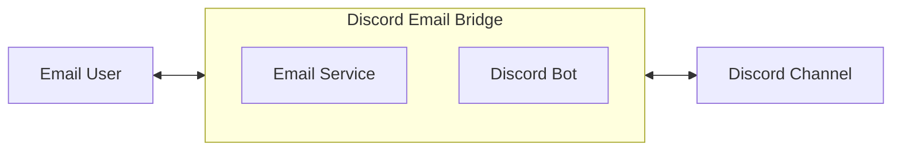

The main goal of the Discord Email Bridge project is to let users participate in discussions on a specific Discord channel by using email.

This document mainly covers software deployment and usage instructions.

Why does this project exist? Some users with visual impairments interact with a computer in one of two ways: through a screen reader, which reads out the content currently shown on screen, or through keyboard shortcuts, which invoke the software's functions. The problem is that many visually impaired users are already accustomed to communicating in the simple way that email offers. If they had to use the Discord platform to talk with their team, they would need to relearn a new set of shortcuts and get used to Discord's interface all over again.

So, to let them focus on communicating instead of on adapting to Discord, this project was created. At its core, this project is a two-way forwarder between an email account and a Discord channel. The Discord Email Bridge forwards content from the mailbox to the Discord channel, and forwards messages from the Discord channel to the mailbox. The architecture is shown below:

In this diagram, the Discord Email Bridge is an executable program written in Python. Message forwarding is implemented through the Email Service and the Discord Bot.

# 1. Invite the Bot to a specific channel

Once the bot has been created, you will have a link, for example `https://discord.com/oauth2/authorize?client_id=xxxxxxxxxxxxxxxxxxx`. Open this link directly in your browser.

1. After opening the link, an "Add" window will appear, as shown below. In this window, select **Add to Server**.

2. After selecting **Add to Server**, the following screen will appear. At this point, you need to confirm the currently logged-in user info that is highlighted, and choose the target server you want to add the bot to from the dropdown menu. Carefully check the highlighted areas: the currently logged-in user, the bot's permissions (fewer is better — two are enough here), and the name of the target server.

3. Confirm the chat permissions the bot needs. To strictly limit the bot's permissions, make sure the permission list only contains **Send Messages** and **Read Message History**. Note that **View Channel** is intentionally not added here, in order to control access. These permissions apply to the entire server — if **View Channel** were granted here, the bot would be able to browse every channel's information, just like a regular member. By only granting **Send Messages** and **Read Message History**, the bot cannot access any channel by default, meaning it cannot access any information in the server (including sending or receiving messages). In the next step, **View Channel** will be enabled on a specific channel only, so that the bot can access that one channel exclusively.

4. Grant the bot permissions on the channel where you want to enable it. Again, to strictly control permissions, keep every permission set to "x" (denied) except **Send Messages**, **Read Message History**, and **View Channel**, which should remain enabled.

# 2. Usage instructions

Before using the bridge, please make sure the bot is online.

## Sending a normal message in Discord

When you send a normal message in Discord, the configured mailbox will receive an email containing the main content of the message along with the sender's information.

## Replying to a message in Discord

When you reply to a previous message in Discord, the mailbox user will receive an email that includes the current sender's name, the message being replied to, and the current message.

## Sending a message directly from email

When a user sends an email to the configured mailbox account, Discord will receive a message. The username shown is the bot's name, and the message content is the body of the email.

## Replying to an existing message from email

When you reply to an existing email in your mailbox, Discord will display the reply in its normal reply style, showing both the current message and the message being replied to.

