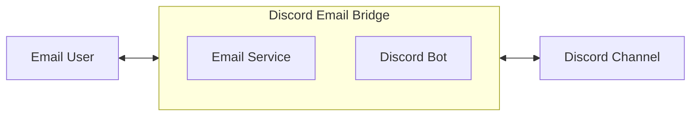

这篇文档假设你已经知道了Discord Email Bridge的项目目的（可以参考用户手册）。这篇文档主要提供开发者需要知道的技术细节。

# 1. 部署

## 1.1 申请邮箱

建议使用一个独立的桥接邮箱账号，不要用私人主邮箱——一是权限泄露的影响面小，二是方便后续单独管理或停用。以 Gmail 为例：

1. 注册一个新的 Gmail 账号专门用作桥接邮箱（也可以用已有账号，但不推荐）。
2. 给这个账号开启两步验证，这是生成"应用专用密码"的前提条件：Google 账号 → 安全性 → 两步验证。

   两步验证开启后，打开[应用专用密码页面](https://myaccount.google.com/apppasswords)，生成一个应用专用密码。

4. 记下这个16位密码（**不是**账号登录密码），后面配置 `.env` 时 `SMTP_PASSWORD` 和 `IMAP_PASSWORD` 都填它。
5. 确认这个 Gmail 账号打开了 IMAP：Gmail 设置 → 转发和 POP/IMAP → 启用 IMAP。


如果用其他邮箱服务商，思路一样：开二次验证/应用密码机制，拿一个专门给第三方程序用的密码，不要把账号登录密码直接填进 `.env`。

## 1.2 创建Discord机器人

《用户手册》里的截图是从"已经拿到邀请链接"开始的，这里补上前面创建 Bot、拿 Token、拿 Channel ID 这几步。

1. 打开 [Discord Developer Portal](https://discord.com/developers/applications)，点击 **New Application**，起个名字（比如 `Email Bridge`）。

   > 

2. 进入左侧 **Bot** 页面，点击 **Add Bot**。
3. 在 Bot 页面：
   - 打开 **Message Content Intent**（程序需要读取消息正文内容）。
   
   > 
   
4. 点击 **Reset Token** 拿到 Bot Token，复制保存好——后面要填进 `.env` 的 `DISCORD_BOT_TOKEN`。**这个 Token 不能提交到 Git，也不能分享给任何人。**

   > 

5. 用最小权限把 Bot 邀请到目标 Server 和目标 Channel——详细图文步骤见《用户手册》第 1 节（生成邀请链接、选择 Server、勾选 `Send Messages` + `Read Message History`、在目标频道单独开 `View Channel`），这里不重复贴图。
6. 拿 Channel ID：Discord 客户端 → 设置 → 高级 → 打开"开发者模式"；然后右键目标频道 → 复制频道 ID。

   > 
   >
   > 

7. （可选）如果只想让 Bot 在某一个特定 Server 里生效，额外记下这个 Server 的 ID（右键 Server 图标 → 复制服务器 ID），后面填 `DISCORD_GUILD_ID`。

## 1.3 配置启动参数

复制配置模板：

```bash
cp .env.example .env
```

逐项填写 `.env`（字段定义见 `config.py`）：

|            变量名            | 必填 |                       说明                       |
| :---------------------------: | :--: | :------------------------------------------------ |
|      `DISCORD_BOT_TOKEN`      |  是  | 1.2 第4步拿到的 Bot Token                         |
|     `DISCORD_CHANNEL_ID`      |  是  | 1.2 第6步拿到的 Channel ID                        |
|      `DISCORD_GUILD_ID`       |  否  | 限定 Bot 只在这一个 Server 生效，不填则不限制     |
|   `SMTP_HOST` / `SMTP_PORT`   |  是  | Gmail: `smtp.gmail.com` / `587`                   |
| `SMTP_USER` / `SMTP_PASSWORD` |  是  | 桥接邮箱地址 / 1.1 生成的应用专用密码             |
|          `SMTP_FROM`          |  是  | 发件人地址，通常和 `SMTP_USER` 一致               |
|   `IMAP_HOST` / `IMAP_PORT`   |  是  | Gmail: `imap.gmail.com` / `993`                   |
| `IMAP_USER` / `IMAP_PASSWORD` |  是  | 同 SMTP，用同一个应用专用密码                     |
|        `TARGET_EMAIL`         |  是  | 接收 Discord 消息的目标邮箱                       |
|    `ALLOWED_EMAIL_SENDER`     |  是  | 唯一允许回复并转发回 Discord 的邮箱地址           |
| `EMAIL_POLL_INTERVAL_SECONDS` |  是  | 轮询邮箱的间隔秒数，建议 `60`                     |
|         `STATE_FILE`          |  否  | 状态文件路径，默认 `state.json`                   |
|   `EMAIL_MESSAGE_ID_DOMAIN`   |  否  | 生成邮件 Message-ID 用的域名，默认 `bridge.local`，不需要是真实域名 |
|   `INCLUDE_DELETED_CONTENT`   |  否  | 删除通知邮件是否包含原始内容，默认 `true`         |

最简单的情况下，`TARGET_EMAIL` 和 `ALLOWED_EMAIL_SENDER` 填同一个人的邮箱。

**`.env` 不能提交到 Git**（已经在 `.gitignore` 里排除）。

## 1.4 运行程序

项目用 [uv](https://docs.astral.sh/uv/) 管理依赖和虚拟环境。

1. 安装 uv（如果还没装）：

   ```bash
   curl -LsSf https://astral.sh/uv/install.sh | sh
   ```

2. 同步依赖（会自动创建 `.venv`，并按 `uv.lock` 锁定的版本安装）：

   ```bash
   uv sync
   ```

3. 运行程序：

   ```bash
   uv run main.py
   ```

4. 启动成功后，日志应该依次出现：配置加载成功 → Discord bot 已连接 → 开始轮询邮箱。`Ctrl+C` 可以停止程序。

   > 

长期运行建议用 systemd（Ubuntu 场景）。仓库里已经有现成的 `discord-email-bridge.service` 模板，改一下里面的 `WorkingDirectory` / `ExecStart` / `User` 就能用，详细步骤见 `README.md` 第 10 节，这里不重复。

# 2. 架构

整体结构复用《用户手册》里的示意图：



Discord Email Bridge 是一个单进程 Python 程序（`discord-email-bridge/`），同时扮演一个 Discord Bot 和一个 SMTP/IMAP 客户端。程序内部按职责拆成 6 个模块，彼此之间只通过函数调用和回调通信，没有引入消息队列或数据库。

## 2.1 模块划分

|       模块        | 职责                                                                                                                                                    |
| :----------------: | :------------------------------------------------------------------------------------------------------------------------------------------------------ |
|    `config.py`     | 配置层。从 `.env`/环境变量读取所有配置项，生成不可变的 `Config` dataclass；必填项缺失时抛 `ConfigError`，程序拒绝启动。                                   |
| `discord_client.py`| Discord 端。`BridgeClient`（`discord.Client` 子类）监听 `on_message` / `on_raw_message_edit` / `on_raw_message_delete`，做 guild/channel/bot 过滤后回调给 `main.py`；`deliver_email_to_channel` 负责把邮件内容投递进频道（优先做成真正的 Discord 回复），并处理长度截断、mention 清理。 |
|  `mail_reader.py`  | 邮件读取端（IMAP）。`poll_mailbox` 连接邮箱、拉取未读邮件，过滤发件人白名单和去重，提取纯文本正文并剥离引用历史，解析 `In-Reply-To`/`References`/`X-Discord-Bridge-ID` 判断回复关系，通过回调交给 `main.py`。 |
|  `mail_sender.py`  | 邮件发送端（SMTP）。把 Discord 消息包装成邮件（新消息 / `[Updated]` / `[Deleted]`），生成 `Message-ID` 及线程头，通过 SMTP 发出。                          |
|     `state.py`     | 状态持久化。维护"已处理邮件 ID"去重集合和 `discord_message_id ↔ email_message_id` 映射表（含编辑版本号、删除状态），原子写入 `state.json`，损坏时自动备份重建。 |
|     `main.py`      | 入口 + 业务编排层。不直接碰网络协议，只调用上面几个模块：处理 Discord 新消息/编辑/删除事件、处理邮件轮询结果、启动 Discord 客户端和邮件轮询循环。            |

## 2.2 数据流

**Discord → Email**

```text
discord_client.on_message
    → main.handle_discord_message
        → mail_sender.send_discord_message_as_email （SMTP）
        → state.add_mapping
```

**Email → Discord**

```text
mail_reader.poll_mailbox （后台线程，定时轮询 IMAP）
    → main.handle_incoming_email （通过 run_coroutine_threadsafe 跳回事件循环）
        → discord_client.deliver_email_to_channel
        → state.add_mapping
```

**编辑 / 删除同步**

```text
discord_client.on_raw_message_edit / on_raw_message_delete
    → main.handle_message_edit / handle_message_delete
        → mail_sender.send_edit_notification / send_delete_notification （SMTP）
        → state.record_edit / record_delete
```

`state.json` 是这一整套流程里唯一的持久化状态，保存 Discord 消息 ID 与 Email Message-ID 之间的双向映射。"邮件回复能变成 Discord 真实回复""编辑/删除通知能找到原始邮件"，都建立在这份映射之上——具体判定规则见 3.1。

## 2.3 并发模型

`main()` 用 `asyncio.gather` 并发跑两件事：

1. `client.start(...)`：discord.py 自己的事件循环，处理 Discord 端所有事件。
2. `email_poll_loop(...)`：每隔 `EMAIL_POLL_INTERVAL_SECONDS` 秒跑一次邮箱轮询。

`imap-tools` 是同步阻塞库，所以 `poll_mailbox` 通过 `loop.run_in_executor` 扔到线程池执行，不会卡住 Discord 事件循环；轮询结果需要调用 Discord API 时，再通过 `asyncio.run_coroutine_threadsafe` 跳回主事件循环执行（Discord 的连接对象只能在它自己的事件循环里用，不能跨线程直接调用）。

# 3. 需求追踪

|       需求模块        |                           简要描述                           |    完成状态    |           测试状态           | 计划版本 |
| :--------------------: | :----------------------------------------------------------: | :------------: | :---------------------------: | :------: |
|      `config.py`       |    必填环境变量缺失时拒绝启动并报错，不使用硬编码密钥        |     已完成     |         手工测试完成          |   0.1    |
|  `discord_client.py`   | · 能够读取和发送discord消息<br/>· 忽略Bot自己发出的Discord消息，避免无限转发循环<br/>· 转发到Discord前清理`@everyone`/`@here`等mention，防止误触发<br/>· Discord消息过长时安全截断并追加提示（1800字符上限）<br/>· 邮件回复的Discord父消息已被删除时，退化为频道普通消息而非报错 |     已完成     |         手工测试完成          |   0.1    |
|    `mail_reader.py`    | · 能够读取邮件（IMAP轮询）<br/>· 仅信任`ALLOWED_EMAIL_SENDER`发来的邮件，其余邮件直接忽略<br/>· 邮件正文优先取纯文本，去除引用历史（"On ... wrote:"等） |     已完成     |         手工测试完成          |   0.1    |
|    `mail_sender.py`    | · 能够发送邮件（SMTP）<br/>· Discord消息被编辑后，邮件端收到一封`[Updated]`通知邮件，包含修改前后的内容对比<br/>· Discord消息被删除后，邮件端收到一封`[Deleted]`通知邮件 |     已完成     |         手工测试完成          |   0.1    |
|    `mail_sender.py`    | 邮件端能清晰区分"新会话"与"延续原会话"，判定规则见3.1；<br/>剩余待定点是邮件标题是否要复用/加`Re:` |    部分完成    | 分组机制已测试；<br/>标题(Subject)复用等细节待定 |   0.3    |
|       `state.py`       | · 同一条Discord消息、同一封邮件不会被重复处理（去重）<br/>· 本地JSON状态文件原子写入，损坏时自动备份并重建 |     已完成     |         手工测试完成          |   0.1    |
|       `main.py`        | · 能够通过回复邮件的方式，在discord中回复消息<br/>· 在discord有消息引用的情况下，邮件端应该显示被引用的消息、当前消息<br/>· 关键事件（收发消息、跳过、错误）记录结构化日志，不打印敏感信息<br/>· SMTP/IMAP/Discord API异常不导致进程崩溃，记录日志后继续运行 |     已完成     |         手工测试完成          |   0.1    |
|     `Dockerfile`（待定）      |                  能够使用Docker快速部署软件                  |     未完成     |                               |   0.2    |
|        `tests/`（待定）       |                      编写自动化测试脚本                      |     未完成     |                               |   0.3    |
|    `mail_reader.py`（待定）   |        邮件只有HTML正文时也能提取内容转发到Discord，不再直接跳过        |     未完成     |                               |   0.4    |
|  `discord_client.py`（待定）  |           支持Discord Thread内的消息双向桥接（还会牵动`state.py`/`mail_sender.py`/`mail_reader.py`，详见3.1）           |     未完成     |                               |   0.5    |

## 3.1 会话（Conversation）判定规则

邮件端的"会话"完全依赖 RFC 5322 的 `Message-ID` / `In-Reply-To` / `References` 三个邮件头做链接，**不依赖邮件标题（Subject）**。这是目前隐含在代码里、但从未写下来的规则，容易在后续改动时被破坏，所以在这里明确记录。

**Discord → Email：什么时候开始新会话，什么时候延续原会话**

- 这条 Discord 消息**不是**对某条已桥接消息的原生回复（`message.reference` 为空，或者引用的消息在 `state.json` 里查不到映射）→ 发一封新邮件，不带 `In-Reply-To` / `References` → 邮箱端出现一个**新会话**。
- 这条 Discord 消息**是**对某条已桥接消息的原生回复，且能在 `state.json` 中查到父消息的映射 → 发邮件时设置 `In-Reply-To` = 父消息对应邮件的 Message-ID，`References` = 父消息的 References 链 + 父消息自身 Message-ID → 邮箱端**延续**父消息所在的会话。
- 找不到父映射时（父消息未桥接过，或映射丢失）→ 仍然发送，但退化为新会话，并记录 warning。

**Email → Discord：什么时候当作回复，什么时候当作新消息**

- 邮件的 `In-Reply-To`（优先）/ `References`（从最后一个往前找）/ `X-Discord-Bridge-ID` 三者之一能在 `state.json` 中解析出一个已知的 Discord 消息 → 在 Discord 中作为该消息的**真实回复**（`original_message.reply()`）。
- 三者都解析不到（例如：用户新写了一封邮件而不是点 Reply；或原 Discord 消息已被删除）→ 作为频道里的一条**新消息**发送。
- 一封邮件一旦在 Discord 侧被当作"新消息"处理，它自己的 Message-ID 会被记录为一个新的会话根；之后不论过多久，只要有人回复这封邮件，都会被识别为延续同一条会话——**目前没有会话过期/超时机制**。

**待定细节（0.3 要收尾的部分）**

- 邮件标题（Subject）目前是"[Discord Bridge] 发送者: 消息首行"，每封邮件都会基于当前内容重新生成，**不会**复用原会话的标题或加 `Re:` 前缀。会话分组完全靠上面的邮件头链条。Gmail、Thunderbird 等主流客户端会正确按 `References` 分组，但严格按标题分组的客户端（部分 Outlook 配置）仍可能把同一会话显示成多封独立邮件。是否需要让延续会话的邮件复用原标题（加 `Re:` 前缀）待评估。

HTML 邮件支持（0.4）：`mail_reader._extract_plain_text` 目前遇到只有 HTML 正文（没有 `text/plain` 部分）的邮件会直接跳过并记日志，不转发到 Discord（`mvp要求.md` 里明确排除的范围）。要支持需要把 HTML 转成可读纯文本（比如用简单的标签剥离或者 `html2text` 之类的库），再走现有的去引用历史逻辑，属于 `mail_reader.py` 内的局部改动，不涉及状态模型或消息映射规则的变化。

Thread 支持（0.5）：Discord Thread 消息的 `channel.id` 不等于父频道 ID，目前会被 `_is_bridged_channel` 直接过滤掉，即 Thread 内的消息完全不会被桥接。要支持需要扩展频道匹配逻辑、状态映射模型（增加 `discord_thread_id`）和邮件侧的 Thread 标识头，详见 4. 软件设计。

## 3.2 版本管理

上表「计划版本」列使用的版本号，就是 `discord-email-bridge/pyproject.toml` 里 `version` 字段（当前 `0.1.0`），遵循语义化版本（SemVer）。详细的版本历史记录在同目录下的 `discord-email-bridge/CHANGELOG.md` 里。

版本号含义：

- **0.1**：当前已上线的基线版本——通讯、消息映射、编辑/删除生命周期通知、安全防护、消息处理、配置与状态、日志与错误处理。
- **0.2**：计划中，Docker 快速部署。
- **0.3**：计划中，会话管理规则收尾（3.1 里"待定细节"那部分）+ 自动化测试脚本。
- **0.4**：计划中，支持只有 HTML 正文的邮件。
- **0.5**：计划中，Discord Thread 支持。

发布流程约定（单人维护，保持简单）：

1. 某个计划版本里的需求全部变成"已完成"后，把 `pyproject.toml` 的 `version` 字段改成对应版本号。
2. 在 `CHANGELOG.md` 里把对应条目从 `[Unreleased]` 移到新版本号下面，写清楚这个版本具体改了什么、哪些提交。
3. 打一个 `git tag vX.Y.Z` 并 `git push origin vX.Y.Z`，作为这个版本的可追溯节点；仓库目前还没有任何 tag，等 0.2 发布时可以从这一步开始。

# 4. 软件设计

本章记录 2. 架构里"数据流"和 3.1"会话判定规则"背后更细一层的设计决定：字段格式、生命周期状态机、容错策略。这些内容原来分散在 `main.py`/`mail_sender.py`/`mail_reader.py`/`state.py` 的注释里，这里把它们集中写下来，避免以后改代码时漏掉某个约束。

## 4.1 消息映射模型

核心是三个 ID 互相绑定：

```text
Discord Message ID
        ↕
Bridge ID
        ↕
Email Message-ID
```

落地在 `state.json` 里，结构是：

```json
{
  "version": 1,
  "processed_email_ids": ["<...>", "imap:123"],
  "message_mappings": {
    "1394195621736857620": {
      "bridge_id": "0c224235-9fbb-4dc9-9fb2-8341e93ae634",
      "discord_message_id": "1394195621736857620",
      "discord_parent_message_id": null,
      "email_message_id": "<discord-1394195621736857620-0c224235@bridge.local>",
      "email_in_reply_to": null,
      "email_references": [],
      "author_name": "Bob",
      "content": "Can you check the Ubuntu workflow?",
      "delivery_status": "sent",
      "created_at": "2026-07-14T18:30:00Z",
      "status": "active",
      "edit_version": 0,
      "last_edit_fingerprint": null,
      "edited_at": null,
      "deleted_at": null,
      "delete_notification_sent": false
    }
  },
  "email_message_index": {
    "<discord-1394195621736857620-0c224235@bridge.local>": "1394195621736857620"
  },
  "last_updated": "2026-07-14T18:30:01Z"
}
```

字段说明：

- `processed_email_ids`：已经成功投递到 Discord 的邮件标识去重集合。优先用邮件自身的 `Message-ID`，缺失时退化为 `imap:<UID>`。
- `message_mappings`：以 Discord Message ID 为键。前半部分（`bridge_id` ~ `created_at`）是创建时写入的，后半部分（`status` ~ `delete_notification_sent`）是编辑/删除生命周期字段，见 4.3。
- `email_message_index`：从 Email Message-ID 反查 Discord Message ID，供邮件回复解析父消息用（见 3.1）。
- 所有 Discord ID 一律存成字符串（Discord 的雪花 ID 超过 JS/部分语言安全整数范围，存字符串更保险）。
- 所有 Email Message-ID 在写入、比较、查询前都必须先过 `normalize_message_id()` 规范化成 `<...>` 形式，否则同一个 ID 因为有没有尖括号会被当成两个不同的键。

单实例假设：MVP 只跑一个进程，`state.json` 没有做文件锁，多实例并发写会互相覆盖。

## 4.2 Bridge ID 与 Email Message-ID

每条新桥接消息（Discord 消息或邮件消息）生成一个 UUID4 作为 `bridge_id`，写入邮件头 `X-Discord-Bridge-ID`。它是桥接系统内部的标识符，不依赖 Discord 或邮件平台自己的 ID 规则，主要用途是在 `In-Reply-To`/`References` 都解析失败时，作为最后一道回退（`state.get_by_bridge_id`）。

Discord → Email 时，`mail_sender.build_message_id` 按下面的格式生成 Email Message-ID：

```text
<discord-{discord_message_id}-{bridge_id 前8位}@{EMAIL_MESSAGE_ID_DOMAIN}>
```

编辑/删除通知邮件另外生成自己的 Message-ID（不复用原邮件的），分别是：

```text
<edit-{discord_message_id}-{edit_version}-{随机8位hex}@{EMAIL_MESSAGE_ID_DOMAIN}>
<delete-{discord_message_id}-{随机8位hex}@{EMAIL_MESSAGE_ID_DOMAIN}>
```

`EMAIL_MESSAGE_ID_DOMAIN` 看起来像邮箱域名，但只是用来拼 Message-ID 的字符串，不需要是真实可解析的域名。

## 4.3 消息生命周期（编辑 / 删除同步）

一条 Discord 消息在 `state.json` 里的 `status` 只有两种取值：`active`、`deleted`。围绕这两个状态，编辑和删除分别有自己的处理流程。

**编辑（`main.handle_message_edit`）**

1. 按 `discord_message_id` 查映射，查不到就忽略（说明这条消息本来就没桥接成功，比如发邮件时 SMTP 失败过）。
2. 如果 `status == "deleted"`，忽略——消息已经标记删除了，不应该再对它发编辑通知。
3. 用 `normalize_content()` 比较新旧正文，完全一致（只是空白差异之类）则跳过，不发通知。
4. 对新正文算 `sha256` 指纹，如果和上次记录的 `last_edit_fingerprint` 相同，也跳过——这是为了防止 Discord 有时会对同一次编辑触发多个 `on_raw_message_edit` 事件，导致重复发通知。
5. 找不到原始邮件的 `email_message_id` 是异常情况（理论上不该发生），记错误日志并放弃，不发通知。
6. 发送 `[Updated]` 通知邮件，`In-Reply-To`/`References` 指向原始邮件，正文包含修改前后内容对比；SMTP 发送成功后，`edit_version` 自增，更新 `content`、`last_edit_fingerprint`、`edited_at`。

**删除（`main.handle_message_delete`）**

Discord 的删除事件（`on_raw_message_delete`）只给一个消息 ID，被删的消息本身已经拿不到内容了，所以完全依赖本地映射里存的 `author_name`/`content`。

1. 按 `discord_message_id` 查映射，查不到就忽略。
2. 如果已经是 `status == "deleted"` 或 `delete_notification_sent == True`，跳过——防止重复的删除事件发出两封通知邮件。
3. 找不到原始邮件的 `email_message_id` 同样是异常情况，记错误日志并放弃。
4. 是否在通知邮件里带上原始内容，由 `INCLUDE_DELETED_CONTENT`（默认 `true`）控制。
5. 发送 `[Deleted]` 通知邮件，`In-Reply-To`/`References` 指向原始邮件；SMTP 发送成功后，把 `status` 置为 `deleted`、记 `deleted_at`、`delete_notification_sent = true`。

**回复一条已被删除的 Discord 消息**

邮件用户看不到 Discord 那边消息已经被删，仍然可能对着旧邮件点 Reply。`main.handle_incoming_email` 在投递前会先查 `state.is_deleted(parent_discord_message_id)`：

- 本地已知父消息被删除 → 直接不尝试 `fetch_message`/`reply()`，退化为频道普通消息，前缀 `📧 Email reply to a deleted Discord message:`。
- 本地不知道，但实际调用 `fetch_message`/`reply()` 时失败（比如另一端刚删除，事件还没处理完）→ 退化为频道普通消息，前缀 `📧 Email reply to an unavailable message:`。

两种退化路径的文案不同，是为了在 Discord 里能区分"这是真的针对已删除消息的回复"还是"临时性的技术原因回复失败"。

## 4.4 状态持久化与容错

`state.json` 的每次修改都走"写临时文件 → flush + fsync → `os.replace`"这一套原子写入流程，不会出现程序在写一半时被杀掉导致文件截断损坏的情况：

```text
写入 state.json.tmp
        ↓
flush + fsync（确保落盘，不只是留在系统缓存里）
        ↓
os.replace 到 state.json （同一文件系统内是原子操作）
```

启动时读取 `state.json`，如果文件不存在就新建一份空状态；如果内容不是合法 JSON、或者结构不对（比如 `message_mappings` 不是对象），会把损坏的文件备份成 `state.json.corrupt-<UTC时间戳>`，然后从空状态重新开始，同时记一条 error 日志——程序不会因为状态文件损坏而拒绝启动。

## 4.5 错误处理与日志约定

三类外部调用（SMTP、IMAP、Discord API）失败都遵循同一个原则：**记日志，不崩溃，不把失败当成功写进 `state.json`**。

|      失败场景      | 处理方式                                                                                     |
| :-----------------: | :--------------------------------------------------------------------------------------------- |
|     SMTP 发送失败    | `main.py` 捕获异常并 `logger.exception`；不调用 `state.add_mapping`/`record_edit`/`record_delete`，相当于这次事件"没发生过"，不会自动重试 |
|   Discord Reply 失败  | 在 `discord_client.deliver_email_to_channel` 内捕获，退化为普通频道消息重试一次；如果这次也失败，返回 `None`，对应邮件不标记为已处理，下一轮轮询会重新尝试 |
|     IMAP 轮询失败    | `email_poll_loop` 捕获异常并记日志，等到下一个 `EMAIL_POLL_INTERVAL_SECONDS` 周期重试，不影响 Discord 端 |
|  必填环境变量缺失   | 启动时直接 `ConfigError`，进程不启动（fail fast，不允许带着不完整配置跑起来）                  |

需要注意的一个限制：SMTP/Discord 发送失败后不写状态，意味着"失败的这一次"不会被自动重试——只有触发它的原始事件（比如下一次编辑这条消息）会再走一遍相同的处理函数，才有机会重新发送。这是当前设计有意的简化（保持无重试队列），如果后续要做，需要在 `state.json` 里加一个"待重试"队列，目前不在 MVP 范围内。

日志用 Python 标准 `logging`，格式统一为 `%(asctime)s [%(levelname)s] %(name)s: %(message)s`。规定：**Discord Bot Token、SMTP/IMAP 密码等敏感信息永远不能出现在日志里**，代码里没有任何一处会打印 `config.discord_bot_token`/`config.smtp_password`/`config.imap_password` 本身。