Discord Email Bridge项目的主要目标，是让用户通过邮件的方式，参与特定Discord频道的讨论。

本文档主要提供软件部署方法和使用说明。

为什么会有这样一个想法呢，是因为对于部分视力受损的用户来说，操作电脑有这样两种路径，一种是靠屏幕阅读器，获取当前软件显示的内容;另一种是通过键盘快捷键，来调用软件的功能。那问题就在于，对于视力受损用户来说，他们部分用户已经习惯了用邮件这种简单的方式来进行沟通。如果必须要discord平台才能和团队沟通，他们就需要重新记快捷方式，适应discord的界面。

所以为了能够让他们把重心放在沟通而不是适应discord上，就开发了这个项目。这个项目本质上是一个双向转发器，转发器的两端分别是邮箱帐号和discord channel，Discord Email Bridge会将邮箱里面的内容，转发到discord channel里面，并且把discord channel里面的信息，转发到邮箱里面。这个项目的结构图如下：

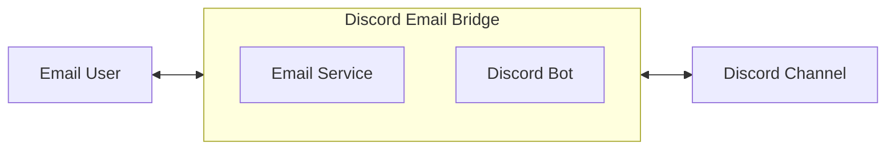

结构图中，Discord Email Bridge是一个可执行程序，基于python编写，消息转发是通过Email Service 和Discord Bot实现的。

# 1. 邀请Bot到特定频道

Bot开发完成之后，会有一个Link，直接在浏览器打开这个link，如https://discord.com/oauth2/authorize?client_id=xxxxxxxxxxxxxxxxxxx。

1. 打开link之后，会直接出现一个添加窗口如下图，在这个图中，选择Add to Server。

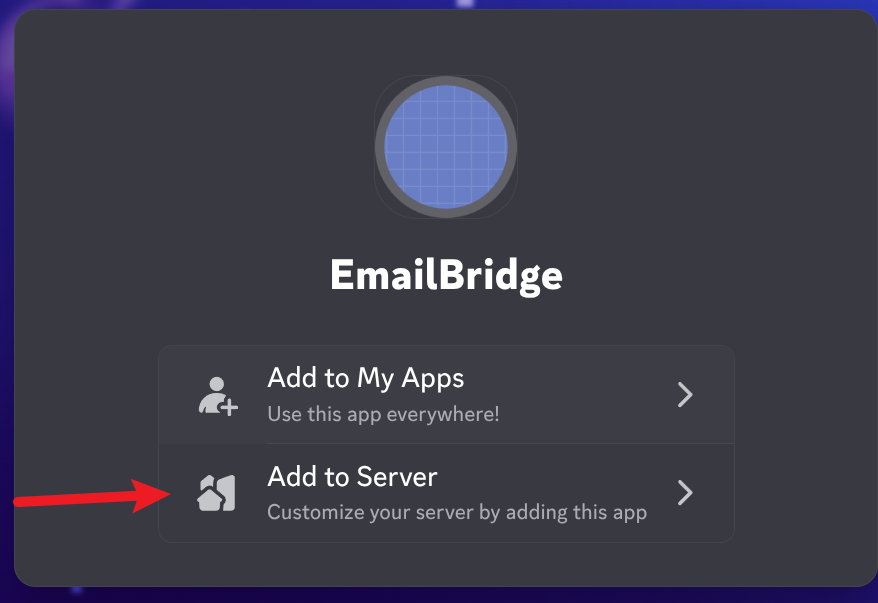

2. 在选中Add to Server之后，会出现如下界面。此时，需要确认标注出来的当前登录用户信息。并在下拉菜单中，选中需要添加的目标Server。这一步需要仔细检查宽选出来的地方，分别是当前登录的用户、确认Bot的权限（越少越好，两个足够了）、目标服务器的名字。

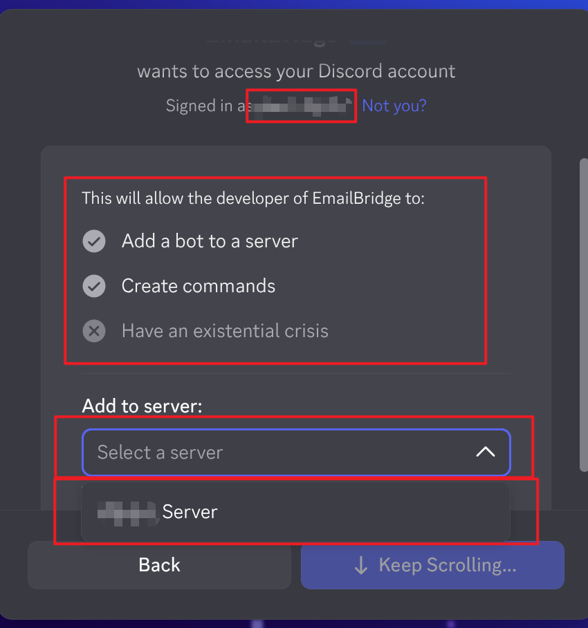

3. 确认bot需要的聊天权限。为了严格控制Bot的权限，请确认权限列表仅有“Send Messages”和"Read Message History"两个权限。注意，为了控制权限，这里没有添加"View Channel"权限。因为这里出现的权限，是针对整个Server的，"View Channel"，Bot将可以像正常人一样浏览所有Channel的信息。所以这里只添加“Send Messages”和"Read Message History"两个权限，让机器人无法访问Channel，相当于无法访问服务器中的所有信息（包括收发消息）。在下一步在特定Channel中启用"View Channel"，达到机器人只可以访问特定频道的目的。

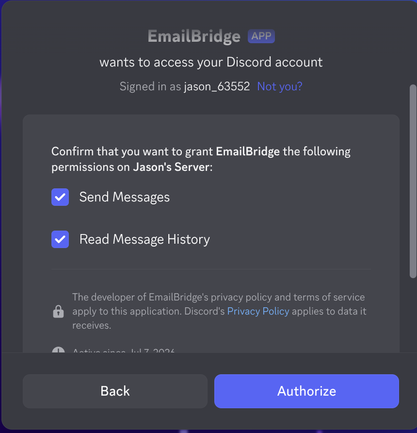

4. 在需要开启Bot的Channel，给机器人权限。同样的，为了严格控制权限，请保持所有权限为"x"，只有"Send Messages"，"Read Message History"和"View Channel"保持开放。

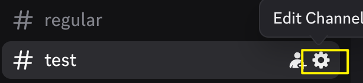

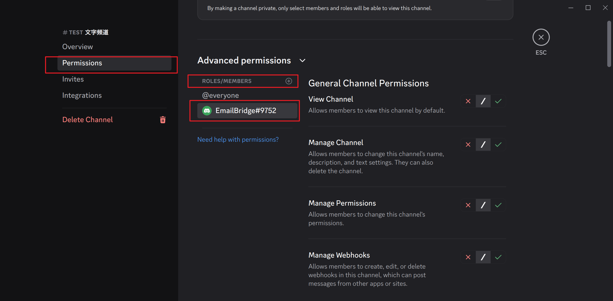

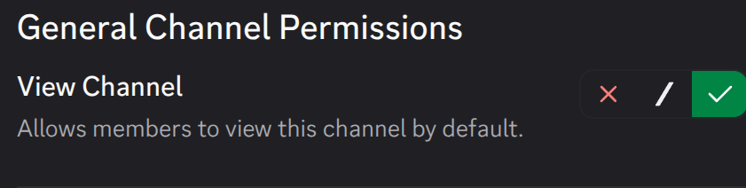

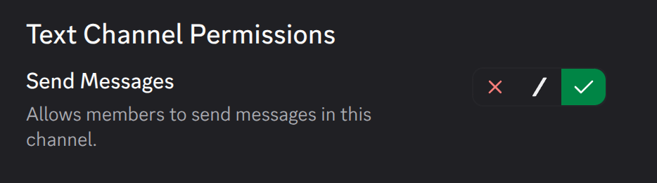

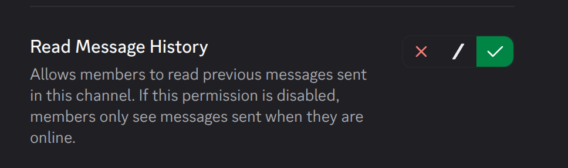

# 2.使用说明
在使用之前，请确认Bot机器人出于在线状态。

## Discord 发送普通消息
在discord里面发送一条普通消息，指定的邮箱会收到一条消息，这条邮件会包含消息的主要内容，和发送者信息。

## 在Discord里面回复一条消息
在Discord里面回复之前的消息，邮箱用户将会收到一封邮件，这封邮件里面有当前信息发送者名字，被回复的消息，当前消息。

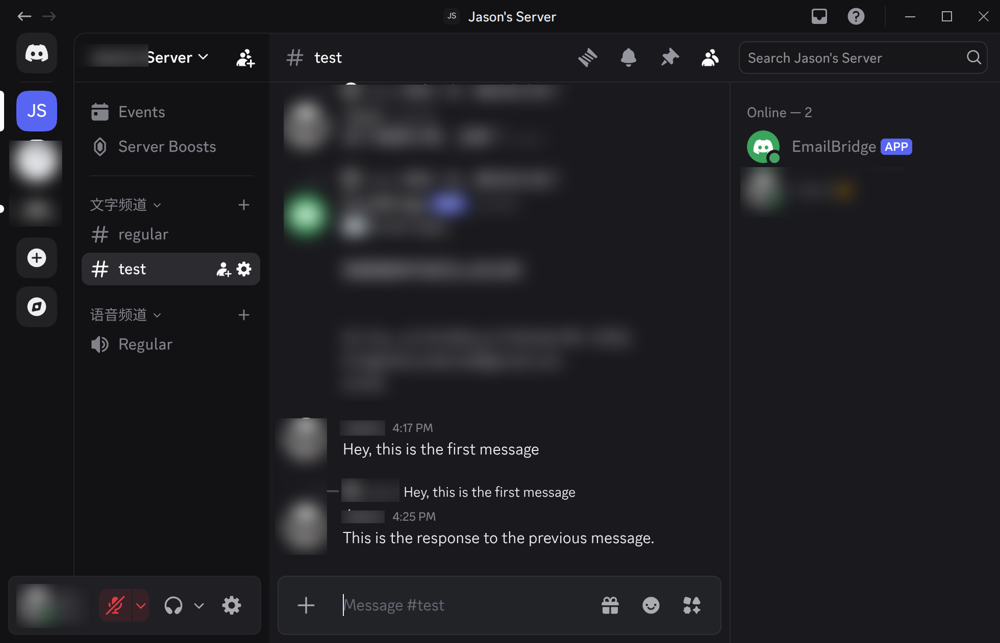

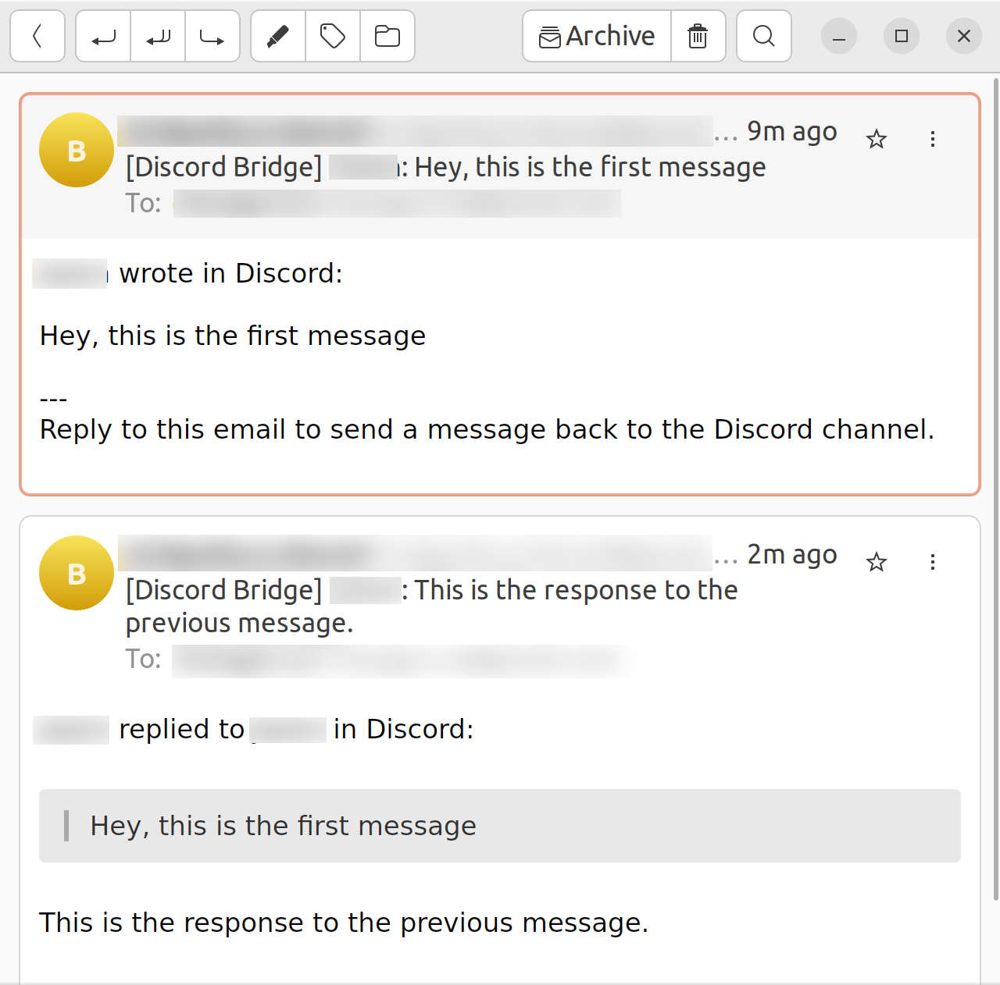

## Email直接发送一条消息
用户的邮箱，向指定的邮箱账户发送邮件，Discord将会收到一条消息。用户名是Bot的名字，消息是邮箱内容。

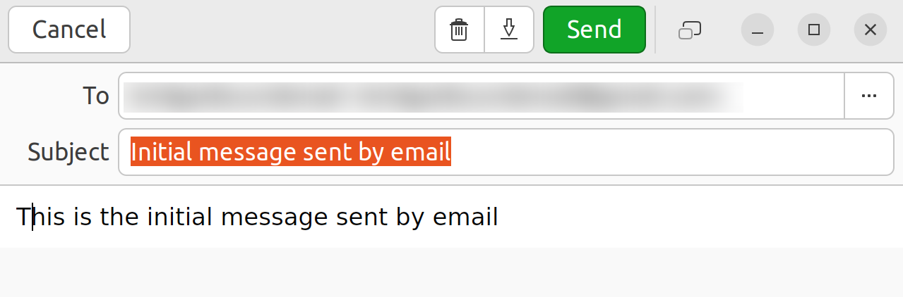

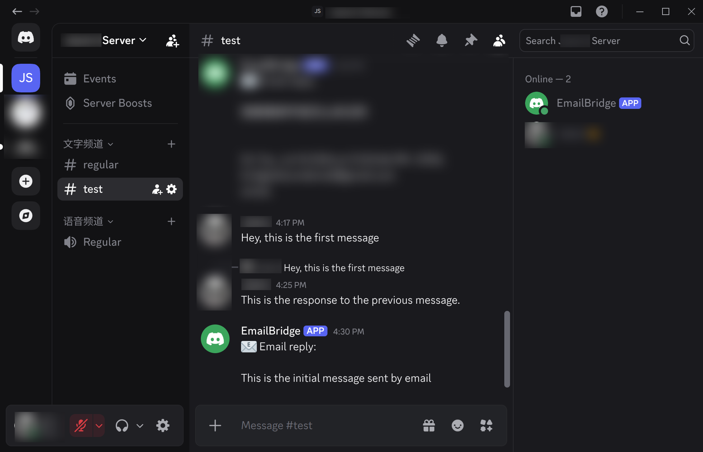

## Email回复已有的一条消息
在邮箱中，对已有的邮件进行回复，在Discord中，将会按照正常显示Discord消息回复的样式，同时显示当前消息和被回复的消息。

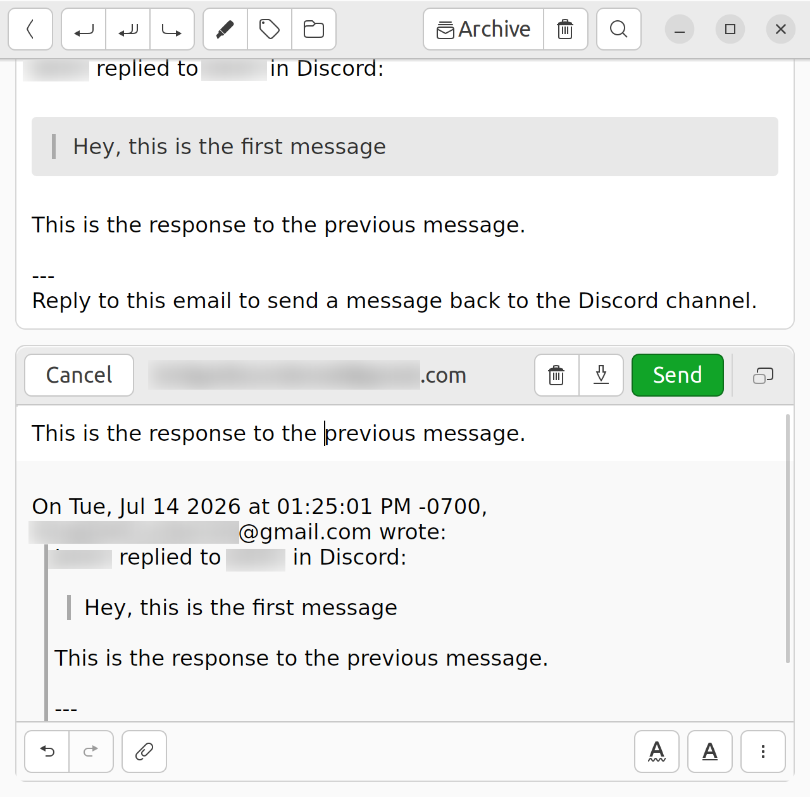

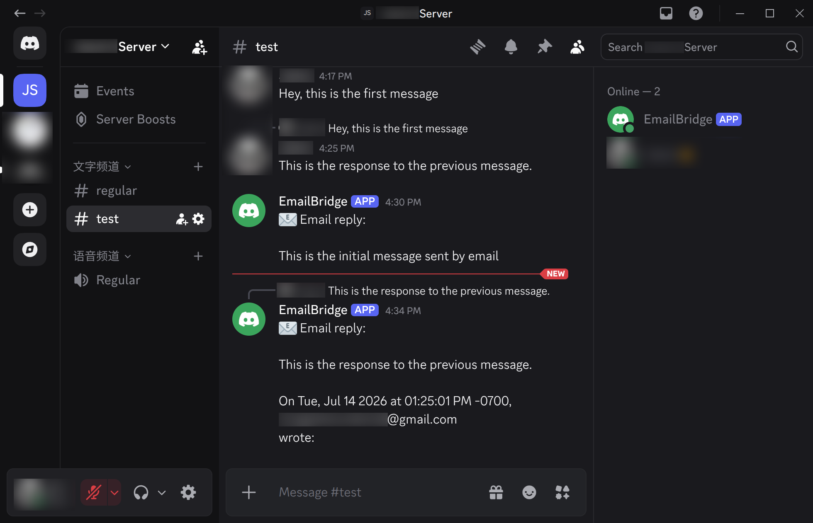
